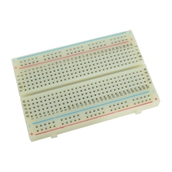
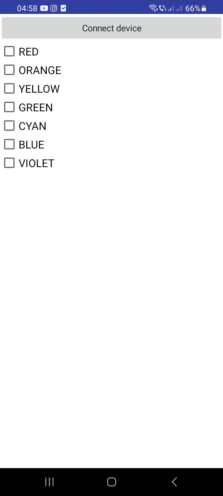
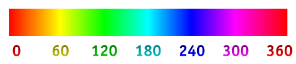
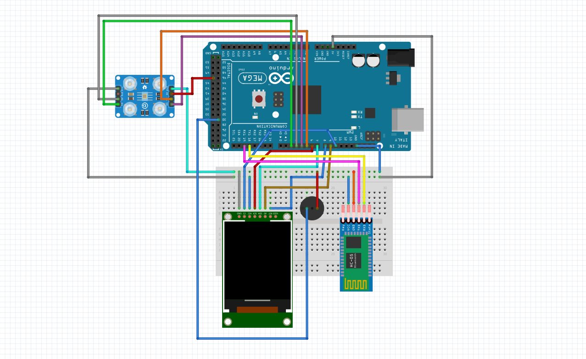

### Description

This project consists of a device that can play colors as sounds, based on a color sensor and a passive buzzer. The range of colors can be selected through an Android application, which communicates with the development board via Bluetooth module. The color perceived by the sensor is displayed on a screen.

### Components Used

The **Arduino Mega 2560** is the development board through which all the components used in this project were connected, providing everything needed for implementation.

The **TCS230 Color Sensor** is the foundation of this project. Through this sensor, the intensity of each color was determined, converting the wavelength of the color into a square wave signal of a certain frequency. The *MD_TCS230.h* and *FreqCount.h* libraries were used for data reading.

The **ST7735 Display** communicates via SPI, displaying data from the buffer on a 128x120 pixel screen, with the help of the *Adafruit_ST7735.h* and *Adafruit_GFX.h* libraries.

A **Passive Buzzer** was used to play the frequency associated with a color. Since the *FreqCount.h* library interferes with the *tone()* function, other libraries were used for sound playback: *TimerFreeTone.h* and *toneAC.h*.

The **HC-05 Bluetooth Module** was used for communication with the Bluetooth application, with the received data being read from the serial.

A **Breadboard** was used for placing the presented components.

### Functionalities

**Color Selection**

Some users may not be interested in all available colors, so through the Bluetooth application, they can select the range of colors that can be played through the buzzer.

For usage, first of all, it is necessary to connect via Bluetooth to the **HC-05** module, then establish a connection with the application through *Connect device*.

### RGB Conversion

The data received from the color sensor is in the form of RGB, components of a color. To play it as sound, this value was converted to wavelength using the following method:

1. First, the RGB value was converted to HUE, in order to convert 3 values into one.

    

2. The HUE value was then converted to wavelength according to the formula:

   
### Electrical Schematic of Components

### References

- [MD_TCS23](https://github.com/MajicDesigns/MD_TCS23)
- [FreqCount](https://www.arduino.cc/reference/en/libraries/freqcount/)
- [ST7735](https://github.com/adafruit/Adafruit-ST7735-Library)
- [TimerFreeTone](https://github.com/pakozm/TinyMusic/blob/master/KeyChainPlayer/TimerFreeTone.cpp)
- [Color to Sound](https://www.flutopedia.com/sound_color.htm)
- [RGB to HUE](https://stackoverflow.com/questions/23090019/fastest-formula-to-get-hue-from-rgb#:~:text=The%20three%20different%20formulas%20are,(R%2DG)%2F(max%2Dmin))
- [Wavelength from HUE](https://stackoverflow.com/questions/11850105/hue-to-wavelength-mapping/11857601#11857601)
- [Wavelength to Color](https://405nm.com/wavelength-to-color/)
